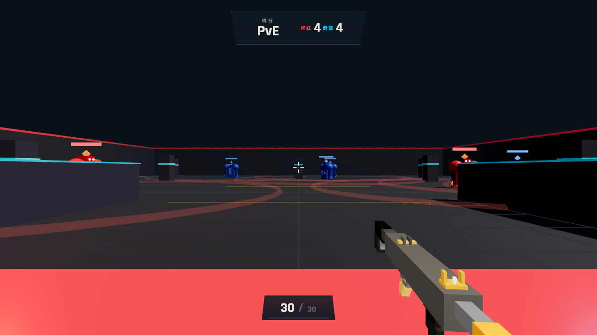

# 王者峡谷 PvE — 野怪追逐

一个跑在浏览器里的第一人称射击游戏。王者峡谷主题的 PvE 训练靶场：在封闭场地里猎杀猩红 / 蔚蓝双阵营野怪，没有时间限制，清完为止。

**Three.js 渲染 · 零构建依赖 · 纯 HTML/CSS/JS**



---

## 快速开始

需要本机已安装 [Node.js](https://nodejs.org/)（仅用于起一个静态服务器，项目本身没有任何 npm 依赖）。

```bash
# 方式一：双击启动（Windows，会自动打开浏览器）
start.bat

# 方式二：命令行
node server.js
```

然后浏览器访问 <http://127.0.0.1:3000>，点击「进入训练」即可。

> **⚠️ 不能直接双击 `index.html`。**
> `game.js` 是 ES Module，用 `file://` 协议打开会被浏览器的 CORS 策略拦截，脚本一行都不会执行，
> 表现为「按钮点了没反应」且页面没有任何提示。必须通过 HTTP 访问。
>
> 如果误用 `file://` 打开了，页面会在约 6 秒后弹出提示告诉你改走 `start.bat`。

---

## 操作说明

| 操作 | 按键 |
|---|---|
| 移动 | `W` `A` `S` `D` |
| 跳跃 | `空格` |
| 瞄准视角 | 鼠标（指针锁定） |
| 射击 | 鼠标左键（可按住连发） |
| 换弹 | `R` |
| 暂停 / 继续 | `Esc` 解除锁定，点击画面恢复 |

移动端会自动启用触摸控件：左下角虚拟摇杆移动，右侧按钮射击 / 换弹，滑动屏幕转视角。

---

## 玩法与数值

- **弹药**：30 发弹匣，1.5 秒换弹。打空会自动换弹，也可以随时按 `R` 提前补满。
  弹药在**插入弹匣那一刻**（进度 55%）补满，而不是等换弹动作播完。
- **伤害**：单发基础 34，爆头 ×2（命中 `name='head'` 的网格）。
- **玩家血量**：100 HP，无回血。受击有屏幕红闪 + 相机抖动 + 闷响三件套反馈；
  血量归零本局结束，结算界面显示「你已阵亡」（评级 F），可重新开局。
- **野怪**：每局随机生成 6~8 只。猩红石像 150 血（5 枪）**近战**；
  蔚蓝石像 100 血（3 枪）**远程**。两种怪都只会朝视线通畅的方向攻击，隔着掩体只绕行不攻击。
- **AI**：野怪警戒区 16m，进入后追逐玩家，且红蓝分工明确：
  - **红怪**追到 2.6m 内抬臂前摇 0.35 秒（反应窗口），随后前冲挥击，命中 **25 伤**，冷却 1 秒；
  - **蓝怪**停在 8m 射程处站桩施法——后仰蓄力 + 双臂抬起 + 头顶宝石渐亮 0.4 秒预警，
    然后前倾掷出直线飞行的魔法弹，**10 伤**，冷却 1.5 秒。弹速 9 m/s（约 0.9 秒飞完 8 米），
    走位即可躲开，撞掩体会碎成蓝色粒子。
- **后坐力**：连续射击时相机上抬 + 随机水平偏移，武器枪口上翘、准星扩散，松手自动回正。
- **结算**：全部击杀（或阵亡）后进入结算界面，并给出评级。

---

## 技术实现要点

几个值得一提的地方：

- **零构建**。没有 webpack / vite / npm 依赖，Three.js 通过 importmap 从 CDN 加载，
  用浏览器原生 ES Module 直接跑。
- **枪械动画用 Catmull-Rom 样条插值**。换弹动作是 6 个关键帧 × 6 个通道（位移 xyz + 旋转 rx/ry/rz）。
  最初用逐段 `easeOutCubic`，虽然首尾值正确，但每段两端斜率都归零，跨关键帧时速度突变，
  60fps 下单帧跳变约 **9.4°**，肉眼是明显抽动。改用 Catmull-Rom（一阶连续）后降到 **0.22°/帧**。
- **音效分层设计**。`SFX_FILES`（key → 路径）+ `WEAPON_SFX`（武器 ID → 槽位映射）两张表，
  新增枪械只需登记两条配置，播放逻辑完全不用动。采样文件缺失时自动回退到 Web Audio 合成音。
- **血条是 3D Sprite + CanvasTexture**，随距离自动缩放。扣血时主条瞬时掉落保证受击可读，
  白色残影延迟 0.18 秒后指数缓动追平（约 0.4 秒）；**仅动画期间每帧重绘**，静止零开销。
- **攻击判定抽纯函数 + 离线仿真**。魔法弹的障碍/玩家命中判定（`projectileHitObstacle` /
  `projectileHitPlayer`）是无 DOM 依赖的纯函数，测试用括号配对从 `game.js` 原文抽取函数体求值，
  不复制实现——抄一份的后果是判定改了测试不会红（假验证）。
- **野怪动作与朝向正交**。`lookAt` 只管根节点的 yaw，攻击的前倾/后仰只转子节点 `bodyPivot`
  的 pitch，血条不进支点——避免同一欧拉角上 yaw/pitch 打架、UI 跟着身体歪。
- **启动守卫**。`index.html` 内置探测脚本，`game.js` 模块顶部会置位 `window.__GAME_BOOTED__`；
  若约 6 秒未置位（典型场景：`file://` 打开导致模块被拦截），就显示诊断提示。

---

## 项目结构

```
shoot/
├── index.html          主页面，UI overlay 结构
├── css/styles.css      样式与响应式布局
├── js/game.js          全部游戏逻辑（约 3400 行）
├── server.js           Node 静态服务器（含自动打开浏览器）
├── start.bat           Windows 双击启动器
├── start.ps1           PowerShell 启动器
├── assets/
│   ├── ak47.glb        AK-47 枪模
│   └── sfx/            音效文件 + CREDITS.md（来源与许可）
└── docs/screenshot.png README 配图
```

---

## 开发文档

这个项目在开发过程中沉淀了比较完整的记录，都在仓库里：

- **[`.workbuddy/memory/`](.workbuddy/memory/)** — 按日期的开发日志，以及
  [`MEMORY.md`](.workbuddy/memory/MEMORY.md)（项目约定与踩坑记录）。
- **[`.workbuddy/tests/`](.workbuddy/tests/)** — 离线仿真测试（不依赖浏览器/Three.js，直接 `node` 跑）：
  碰撞 29 项、绕行 33 项、弹丸判定 18 项；改完代码跑一遍，全绿才算过（见 CONTRIBUTING.md）。
- **[`.learnings/`](.learnings/)** — 复盘条目，记录了一些可复用的工程结论，例如：
  - `node --check` 对 `.js` 文件**不可靠**：同一份含多余右括号的文件，
    `--check x.mjs` 退出码 1（能抓到），`--check x.js` 退出码 0（**漏检**，因为按 CommonJS 解析）。
    这个洞曾让一段「打不开游戏」的代码被判成通过。
  - 动画曲线要验证**边界速度连续性**，而不只是首尾值。
  - 用零依赖的裸 CDP（Node 22 内置 WebSocket）驱动无头 Chrome，
    能一次性锁定「点击按钮无反应」这类靠读代码很难定位的前端 Bug。

---

## 已知限制

- **枪模是低模**。当前用的是 `assets/ak47.glb`（47KB，29 个网格），视觉上偏方块。
  原本的高模 `ak47_2.glb` 是下载中断的残档（GLB 头声明 5068520 字节、实际只有 2056192 字节，
  缺约 2.9MB），二进制数据缺失无法修复，已删除。如需高模请重新下载一份完整的 GLB，
  放回 `assets/` 并在 `loadFirstAvailableModel` 的数组里加回路径。
- **Google Fonts 在国内不可达**，所以字体已改为非阻塞加载，并保留了系统中文字体兜底。

---

## 音效素材与许可

| 文件 | 来源 | 许可 |
|---|---|---|
| `mag-out.wav` / `mag-in.wav` / `bolt-click.mp3` | [OpenGameArt "Gun reload sounds"](https://opengameart.org/content/gun-reload-sounds) 等 | **CC0 1.0** |
| `ak47-shot.wav` | 本项目程序化合成（7 层物理模型） | 自有，无第三方权利 |

枪声没有采用现成录音：候选素材要么许可自相矛盾（页面标 CC0、包内 `creativecommons.txt` 写 CC-BY 3.0），
要么波形不合格（起音 20ms 内缓升，没有枪声应有的 1~2ms 尖锐前沿）。完整调研过程与排除理由见
[`assets/sfx/CREDITS.md`](assets/sfx/CREDITS.md)。

---

## 技术栈

Three.js 0.160 · Pointer Lock API · Web Audio API · GLTFLoader · 原生 ES Module
