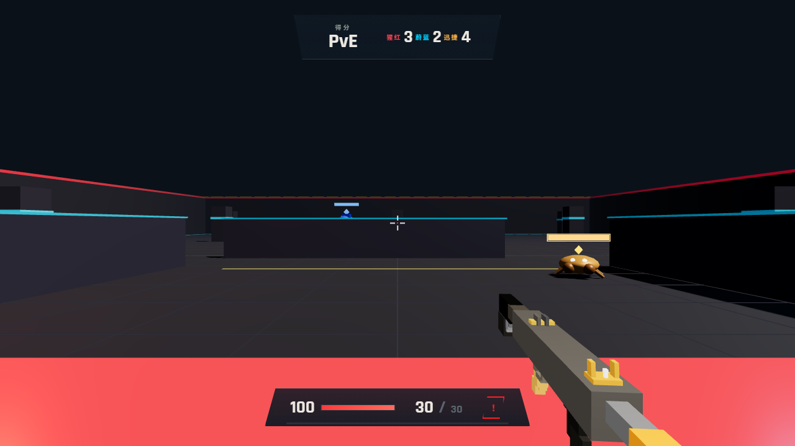

# 王者峡谷 PvE — 野怪追逐

一个跑在浏览器里的第一人称 PvE 射击游戏。王者峡谷主题：闯过 5 个线性解锁的关卡，猎杀猩红 / 蔚蓝双阵营石像与迅捷蟹，拿 S 评级、攒通关进度——压力来自「下一秒该先杀谁」的决策，而不是数值墙。

**Three.js 渲染 · 零构建依赖 · 纯 HTML/CSS/JS**



---

## 快速开始

需要本机已安装 [Node.js](https://nodejs.org/)（仅用于起一个静态服务器，项目本身没有任何 npm 依赖）。

```bash
# 方式一：双击启动（Windows，会自动打开浏览器）
start.bat

# 方式二：命令行
node server.js
```

然后浏览器访问 <http://127.0.0.1:3000>，点「继续游戏 · L1」开局（玩过的会直进当前进度关），或用「选择关卡」挑已解锁的关卡。

> **⚠️ 不能直接双击 `index.html`。**
> `game.js` 是 ES Module，用 `file://` 协议打开会被浏览器的 CORS 策略拦截，脚本一行都不会执行，
> 表现为「按钮点了没反应」且页面没有任何提示。必须通过 HTTP 访问。
>
> 如果误用 `file://` 打开了，页面会在约 6 秒后弹出提示告诉你改走 `start.bat`。

---

## 操作说明

| 操作 | 按键 |
|---|---|
| 移动 | `W` `A` `S` `D` |
| 跳跃 | `空格` |
| 瞄准视角 | 鼠标（指针锁定） |
| 射击 | 鼠标左键（可按住连发） |
| 换弹 | `R` |
| 暂停 / 继续 | `Esc` 解除锁定，点击画面恢复 |

移动端会自动启用触摸控件：左下角虚拟摇杆移动，右侧按钮射击 / 换弹，滑动屏幕转视角。

---

## 玩法与数值

### 关卡与进度

- **5 关线性解锁**：峡谷初见 → 蔚蓝威胁 → 野区窄道 → 蟹群来袭 → 暗影先锋。
  通关解锁下一关，结算写入 localStorage 存档（最佳评级 / 最佳分数 / 通关次数）；
  坏档自动备份重置，多标签页合并进度，隐私模式降级为内存档继续玩。
- **三套场地**：默认布局（双隔断 + 掩体柱）、野区窄道（中路 S 形双窄口，L3/L4）、
  开阔祭坛（2×3 双柱阵，L5）。每次进关清场重建。
- **评级 S / A / B / F**（每关独立结算）：
  - **S**：命中率 ≥75.7% 且爆头率 ≥40% 且未阵亡且用时 ≤ parTime×1.2（每关的 parTime 按数值推导给出）；
  - **A**：命中率 ≥65.7% 且未阵亡；**B**：通关保底；**F**：阵亡。
  - 阈值不是拍脑袋：命中率门 = 14 局实测中位数 70.7% ± 5pp（M0 标定）。

### 战斗数值

- **弹药**：30 发弹匣，1.5 秒换弹。打空自动换弹，也可按 `R` 提前补满。
  弹药在**插入弹匣那一刻**（进度 55%）补满，而不是等换弹动作播完。
- **伤害**：单发基础 34，爆头 ×2（蟹没有头部判定，爆头不加成）。
- **玩家血量**：100 HP，无回血。受击有屏幕红闪 + 相机抖动 + 闷响反馈；归零本局结束。
- **野怪**：实际血量 = 下表基座 × 关卡倍率（1.0 / 1.1）× 1.5（全局校准系数，
  来自 M0 对真实玩家命中率的标定）——例如 L1 的猩红石像实际 225 血 ≈ 7 枪。

| 怪种 | 基座血量 | 行为 | 伤害 |
|---|---|---|---|
| 猩红石像 | 150 | 近战：2.6m 内抬臂前摇 0.35s（反应窗口）→ 前冲挥击，冷却 1s | 25 |
| 蔚蓝石像 | 100 | 远程：停 12m 射程施法，后仰 + 宝石渐亮 0.4s 预警 → 直线魔法弹（9 m/s，可躲），冷却 1.5s | 10 |
| 迅捷蟹 | 68 | 贴地突进 8.0（比疾跑快，跑不掉）但**转向钝**（120°/s，横向滑步能甩）：扑击前 0.3s 压低蓄力，扑向锁定可侧移躲，扑完必后跳 1.6m（节奏窗口）；爆头不加成 | 5 / 扑 |
| 精英红 / 精英蓝 | 300 / 220 | 红蓝同行为放大：体型 ×1.3（紫魔纹 + 大宝石）、伤害 ×1.5、追速 ×0.9（风筝有解，血厚逼你集火） | 37.5 / 15 |

- **AI 通用规则**：警戒区 24m（进图即追），只在视线通畅时攻击，隔着掩体只绕行不隔墙打；
  野怪之间有软分离，不会叠成一团。
- **后坐力**：连续射击时相机上抬 + 固定水平弹道图案（可练习），武器枪口上翘、准星扩散，松手自动回正。
- **结算**：全歼野怪 → 通关结算（评级按上表规则，最高 S）；阵亡 → 「你已阵亡」（F），可重试本关或回选关。

---

## 技术实现要点

几个值得一提的地方：

- **零构建**。没有 webpack / vite / npm 依赖，Three.js 通过 importmap 从 CDN 加载，
  用浏览器原生 ES Module 直接跑。
- **布局即数据**。三套场地是 `levels.js` 里的障碍 descriptor 预设，每次进关由
  `applyLayout` 清场重建（旧几何 dispose + 碰撞体同步清空）；`validateLayout`
  在静态检查期把关出生点净空与 0.8m 最小间距，摆错坐标进不了主干。
- **枪械动画用 Catmull-Rom 样条插值**。换弹动作是 6 个关键帧 × 6 个通道（位移 xyz + 旋转 rx/ry/rz）。
  最初用逐段 `easeOutCubic`，虽然首尾值正确，但每段两端斜率都归零，跨关键帧时速度突变，
  60fps 下单帧跳变约 **9.4°**，肉眼是明显抽动。改用 Catmull-Rom（一阶连续）后降到 **0.22°/帧**。
- **音效分层设计**。`SFX_FILES`（key → 路径）+ `WEAPON_SFX`（武器 ID → 槽位映射）两张表，
  新增枪械只需登记两条配置，播放逻辑完全不用动。采样文件缺失时自动回退到 Web Audio 合成音。
- **血条是 3D Sprite + CanvasTexture**，随距离自动缩放。扣血时主条瞬时掉落保证受击可读，
  白色残影延迟 0.18 秒后指数缓动追平（约 0.4 秒）；**仅动画期间每帧重绘**，静止零开销。
- **攻击判定抽纯函数 + 离线仿真**。魔法弹的障碍/玩家命中判定（`projectileHitObstacle` /
  `projectileHitPlayer`）是无 DOM 依赖的纯函数，测试用括号配对从 `game.js` 原文抽取函数体求值，
  不复制实现——抄一份的后果是判定改了测试不会红（假验证）。
- **野怪动作与朝向正交**。`lookAt` 只管根节点的 yaw，攻击的前倾/后仰只转子节点 `bodyPivot`
  的 pitch，血条不进支点——避免同一欧拉角上 yaw/pitch 打架、UI 跟着身体歪。
- **启动守卫**。`index.html` 内置探测脚本，`game.js` 模块顶部会置位 `window.__GAME_BOOTED__`；
  若约 6 秒未置位（典型场景：`file://` 打开导致模块被拦截），就显示诊断提示。

---

## 项目结构

```
shoot/
├── index.html          主页面，UI overlay 结构（开始屏 / 选关屏 / HUD / 结算屏）
├── css/styles.css      样式与响应式布局
├── js/
│   ├── game.js         游戏主逻辑：渲染 / 移动 / 射击 / 野怪 AI 状态机 / UI（约 4300 行）
│   ├── monsters.js     怪种工厂：五种怪的建模骨架 + 数值基座 + 血条系统
│   ├── save.js         localStorage 读写层：M0 标定样本 + 关卡进度存档
│   └── config/
│       ├── weapons.js  武器参数表（per-weapon 数值唯一真源）
│       └── levels.js   关卡表 L1-L5 + 场地布局预设 + 评级阈值 + schema 校验器
├── server.js           Node 静态服务器（含自动打开浏览器）
├── start.bat           Windows 双击启动器
├── start.ps1           PowerShell 启动器
├── assets/
│   ├── ak47.glb        AK-47 枪模
│   └── sfx/            音效文件 + CREDITS.md（来源与许可）
└── docs/
    ├── level-system-design.md  关卡系统设计文档（全部数值挂推导或验收路径）
    └── screenshot.png  README 配图
```

---

## 开发文档

这个项目在开发过程中沉淀了比较完整的记录，都在仓库里：

- **[`docs/level-system-design.md`](docs/level-system-design.md)** — 关卡系统设计文档：
  5 关的数值推导（血池/评级门/parTime 全部挂着 rationale 或验收路径）、
  怪种规格、场地变体、分期路线图与 playtest 失败信号。
- **[`.workbuddy/memory/`](.workbuddy/memory/)** — 项目约定与踩坑记录
  （[`MEMORY.md`](.workbuddy/memory/MEMORY.md)）。
- **[`.workbuddy/tests/`](.workbuddy/tests/)** — 离线仿真测试（不依赖浏览器/Three.js，直接 `node` 跑）：
  碰撞与分离 36 项、绕行与蟹转向钝验收 43 项、伤害判定 28 项、关卡/存档/评级 60 项；
  另有 CDP 无头 Chrome 端到端探针（`level-probe.js`，22 项：闯关/存档/切关无残留/移动端布局）。
  改完代码跑一遍，全绿才算过（见 CONTRIBUTING.md）。
- **[`.learnings/`](.learnings/)** — 复盘条目，记录了一些可复用的工程结论，例如：
  - `node --check` 对 `.js` 文件**不可靠**：同一份含多余右括号的文件，
    `--check x.mjs` 退出码 1（能抓到），`--check x.js` 退出码 0（**漏检**，因为按 CommonJS 解析）。
    这个洞曾让一段「打不开游戏」的代码被判成通过。
  - 动画曲线要验证**边界速度连续性**，而不只是首尾值。
  - 用零依赖的裸 CDP（Node 22 内置 WebSocket）驱动无头 Chrome，
    能一次性锁定「点击按钮无反应」这类靠读代码很难定位的前端 Bug。

---

## 已知限制

- **枪模是低模**。当前用的是 `assets/ak47.glb`（47KB，29 个网格），视觉上偏方块。
  原本的高模 `ak47_2.glb` 是下载中断的残档（GLB 头声明 5068520 字节、实际只有 2056192 字节，
  缺约 2.9MB），二进制数据缺失无法修复，已删除。如需高模请重新下载一份完整的 GLB，
  放回 `assets/` 并在 `loadFirstAvailableModel` 的数组里加回路径。
- **Google Fonts 在国内不可达**，所以字体已改为非阻塞加载，并保留了系统中文字体兜底。

---

## 音效素材与许可

| 文件 | 来源 | 许可 |
|---|---|---|
| `mag-out.wav` / `mag-in.wav` / `bolt-click.mp3` | [OpenGameArt "Gun reload sounds"](https://opengameart.org/content/gun-reload-sounds) 等 | **CC0 1.0** |
| `ak47-shot.wav` | 本项目程序化合成（7 层物理模型） | 自有，无第三方权利 |

枪声没有采用现成录音：候选素材要么许可自相矛盾（页面标 CC0、包内 `creativecommons.txt` 写 CC-BY 3.0），
要么波形不合格（起音 20ms 内缓升，没有枪声应有的 1~2ms 尖锐前沿）。完整调研过程与排除理由见
[`assets/sfx/CREDITS.md`](assets/sfx/CREDITS.md)。

---

## 技术栈

Three.js 0.160 · Pointer Lock API · Web Audio API · GLTFLoader · 原生 ES Module
